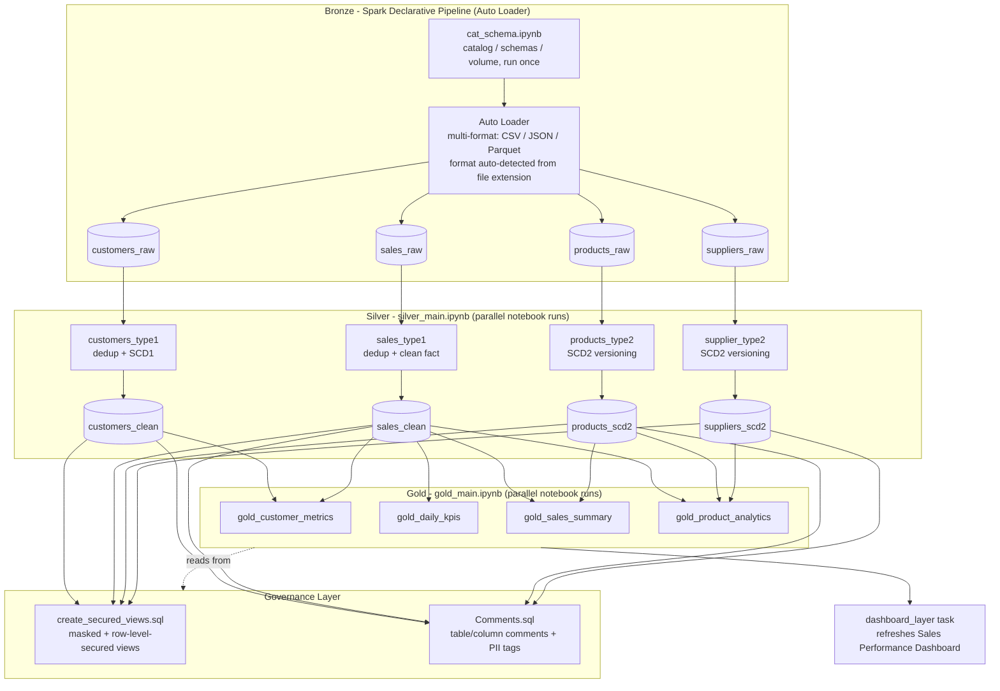
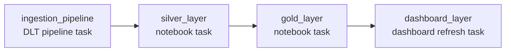
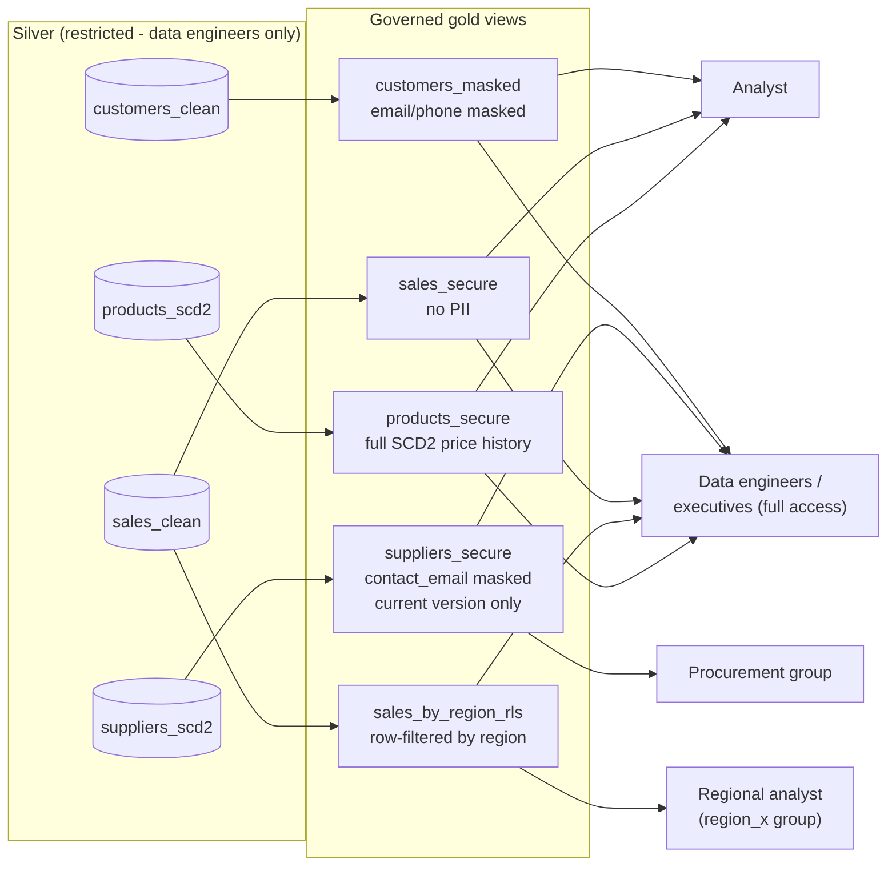

# Data Engineering Project

A Databricks Asset Bundle (DAB) implementing a **Bronze -> Silver -> Gold**
medallion pipeline for customer, product, sales, and supplier data, with a
governed, access-controlled reporting layer and a live dashboard refresh on
top. Deploys across `dev`, `uat`, and `prod` targets from a single codebase.

---

## Architecture



### Layer summary

| Layer | What happens | Key techniques |
|---|---|---|
| **Bronze** | A single Spark Declarative Pipeline (`Ingestion_pipeline`) uses Auto Loader to incrementally ingest customers/products/sales/suppliers. File format (CSV/JSON/Parquet) is auto-detected per source folder, not hardcoded. | Auto Loader, `@dlt.table`, `@dlt.expect` data-quality checks |
| **Silver** | `silver_main.ipynb` fans out to 4 notebooks in parallel via `ThreadPoolExecutor`. Customers use SCD Type 1 (overwrite), products and suppliers use full SCD Type 2, sales is a deduplicated clean fact table. | `ROW_NUMBER()` dedup, `MERGE INTO`, SCD1 vs SCD2 |
| **Gold** | `gold_main.ipynb` fans out to 4 reporting notebooks in parallel: CLV/segmentation, daily KPIs with moving averages, YoY sales summary, product/supplier analytics with price history. | Window functions (`LAG`, `RANK`, `PERCENT_RANK`, `SUM() OVER`) |
| **Governance** | Masked/row-secured views sitting in front of silver, plus table & column documentation and PII tags. | `is_account_group_member()`, `COMMENT ON`, `ALTER ... SET TAGS` |
| **Dashboard** | `dashboard_layer` job task refreshes the Sales Performance Lakeview dashboard once gold is rebuilt. | Lakeview `dashboard_task` |

---

## Job DAG (`data_engineering_project_job`)



Four sequential job tasks, each waiting on the previous. Within `silver_layer`
and `gold_layer`, the four underlying notebooks run in parallel via
`ThreadPoolExecutor` rather than one-by-one, so the wall-clock cost of each
stage is roughly the slowest single notebook, not the sum of all four.

---

## Governance model



**Access rules implemented in `src/governance/create_secured_views.sql`:**

| View | Masking rule |
|---|---|
| `gold.customers_masked` | `email`/`phone` full for `data_engineers`/`executives`, masked for everyone else |
| `gold.suppliers_secure` | `contact_email` full for `procurement`/`data_engineers`, masked for everyone else. Filters to `is_current = true`. |
| `gold.sales_by_region_rls` | Row-level: regional analysts (`region_<region>` group) see only their region |
| `gold.sales_secure`, `gold.products_secure` | No PII - exposed as-is (products includes full SCD2 price history) |

Create the referenced Unity Catalog account groups (`data_engineers`,
`executives`, `procurement`, `region_<region>`) before relying on these
views - `is_account_group_member()` returns `false` for a group that
doesn't exist, which fails closed (safe) rather than open.

Every table and most columns also carry `COMMENT` documentation and
`pii_level` / `data_classification` tags (`src/governance/Comments.sql`) -
searchable in Catalog Explorer for data discovery and PII auditing.

---

## Repo layout

```
data_engineering_project/
├── databricks.yml                       # bundle + target (dev/uat/prod) definitions
├── pyproject.toml                       # local Python deps
├── AGENTS.md / CLAUDE.md                # instructions for AI coding agents working in this repo
├── resources/
│   ├── ingestion_bundle_resource.pipeline.yml  # Spark Declarative Pipeline (bronze)
│   └── ingestion_layer.job.yml                 # end-to-end job: bronze -> silver -> gold -> dashboard
├── src/
│   ├── cat_schema.ipynb                 # creates catalog/schemas/volume, run once per environment
│   ├── generation.py                    # synthetic source data generator
│   ├── Includes.ipynb                   # shared setup helpers
│   ├── bronze/
│   │   └── ingestion_pipeline/
│   │       └── transformations/         # customers.py, products.py, sales.py, suppliers.py, utils.py, config.py
│   ├── silver/
│   │   ├── silver_main.ipynb            # orchestrator - runs the 4 notebooks below in parallel
│   │   ├── customers_type1.ipynb        # SCD1
│   │   ├── products_type2.ipynb         # SCD2
│   │   ├── sales_type1.ipynb            # clean fact table
│   │   └── supplier_type2.ipynb         # SCD2
│   ├── gold/
│   │   ├── gold_main.ipynb              # orchestrator - runs the 4 notebooks below in parallel
│   │   ├── gold_customer_metrics.ipynb / .sql
│   │   ├── gold_daily_kpis.ipynb / .sql
│   │   ├── gold_sales_summary.ipynb / .sql
│   │   └── gold_product_analytics.ipynb / .sql
│   └── governance/
│       ├── create_secured_views.sql     # masked + row-level-secured gold views
│       └── Comments.sql                 # table/column comments + PII/classification tags
├── data/raw/                            # sample source CSVs for local testing
├── fixtures/                            # test fixtures
└── tests/                               # pytest suite
```

---

## Prerequisites

- [Databricks CLI](https://docs.databricks.com/dev-tools/cli/databricks-cli.html)
- Access to the target Databricks workspace(s)
- A Unity Catalog SQL warehouse
- Unity Catalog account groups for governance: `data_engineers`,
  `executives`, `procurement`, and one `region_<region>` group per sales
  region (see **Governance model** above)

## Environments

The `catalog` value is declared as a bundle variable (`variables.catalog`
in `databricks.yml`) and overridden per target (`dev` / `uat` / `prod`),
flowing into the pipeline, job, and notebook parameters at deploy time.

> **Before deploying to a new catalog/environment**, the catalog itself
> must exist in Unity Catalog before `bundle deploy` runs — the pipeline
> resource's `catalog:` setting is validated against Unity Catalog at
> deploy time, before any task (including `cat_schema.ipynb`) executes.
> Run `cat_schema.ipynb` manually against the target catalog once, or
> provision the catalog via SQL/IaC, before the first deploy to that target.

## Setup

```bash
# authenticate to your workspace
databricks configure
```

## Deploying

```bash
databricks bundle deploy -t dev
databricks bundle deploy -t uat
databricks bundle deploy -t prod
```

## Running

```bash
databricks bundle run data_engineering_project_job -t dev
```

This runs the full chain: `ingestion_pipeline` (bronze) -> `silver_layer` ->
`gold_layer` -> `dashboard_layer`.

## Applying governance

Not currently wired into `ingestion_layer.job.yml` — run manually via a SQL
warehouse (or attach as a job task after `gold_layer`) once gold has been
populated at least once, binding `:catalog` to your target catalog when
executing `src/governance/create_secured_views.sql` and
`src/governance/Comments.sql`.

---

## Known gaps / follow-ups

- **Governance SQL is not yet wired into the job.** Attach
  `create_secured_views.sql` and `Comments.sql` as tasks after `gold_layer`
  (and before `dashboard_layer`) if automated view/tag refresh is needed on
  every run.
- **Referenced UC account groups must exist.** `is_account_group_member()`
  in the governance views fails closed (denies access) for a group that
  hasn't been created — create `data_engineers`, `executives`,
  `procurement`, and `region_<region>` groups in your account console
  before granting anyone access to the masked views.
- **`cat_schema.ipynb` must be run manually before the first deploy** to
  any new catalog/environment — see the callout under **Environments**
  above.